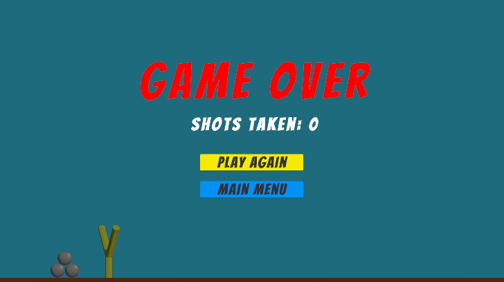

The enhancements add to this version of Mission Demolition compared to the version in the book are the styles of the castles.

### Castle 1

### Castle 2

### Castle 3

### Castle 4

Another addition to the game was adding a line reader to act like the a rubberband for the slingshot

The last enhancements are sound additions, Main Menu screen, and a Game Over screen

